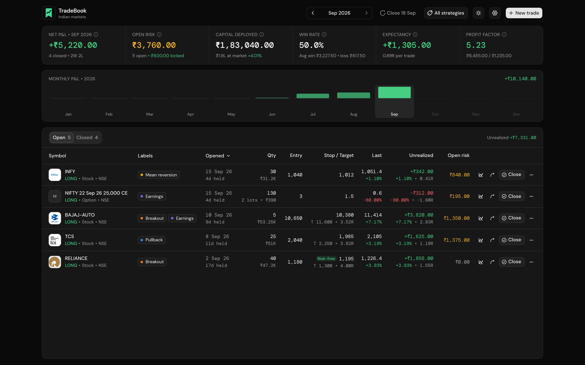
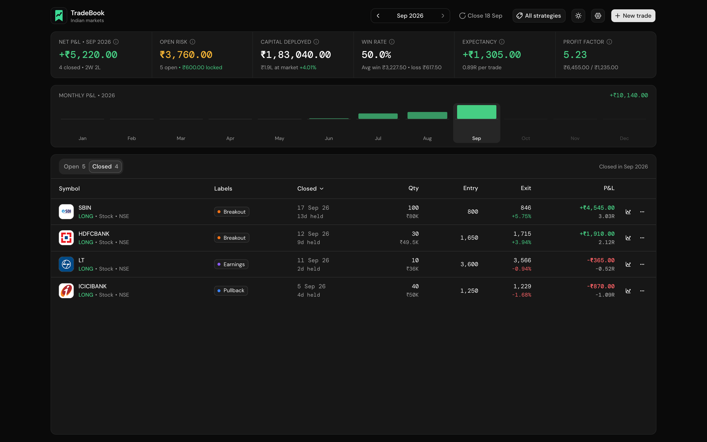
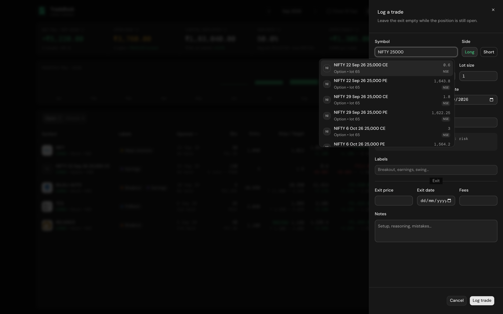
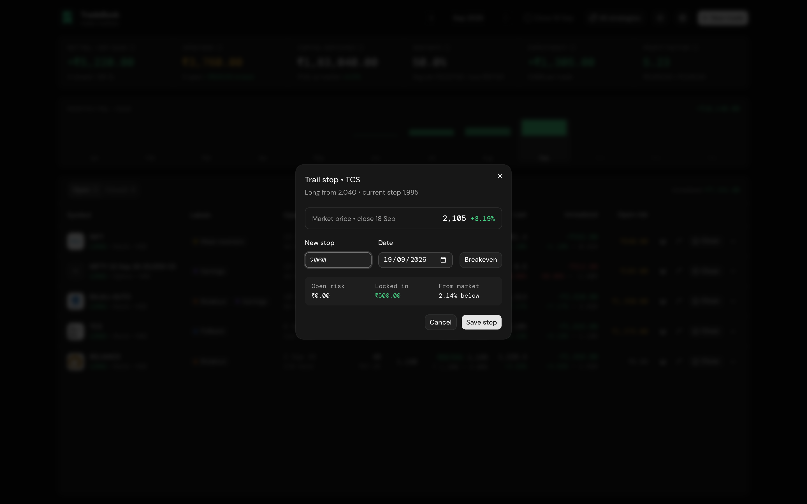
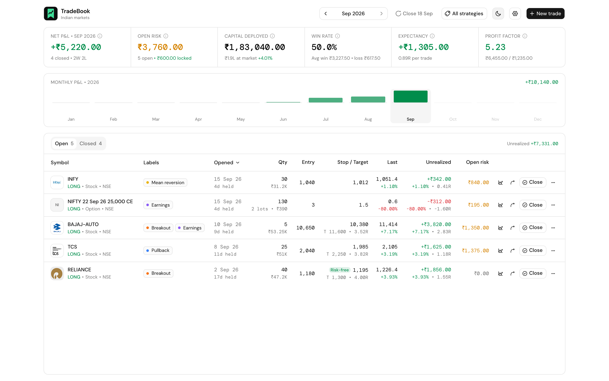
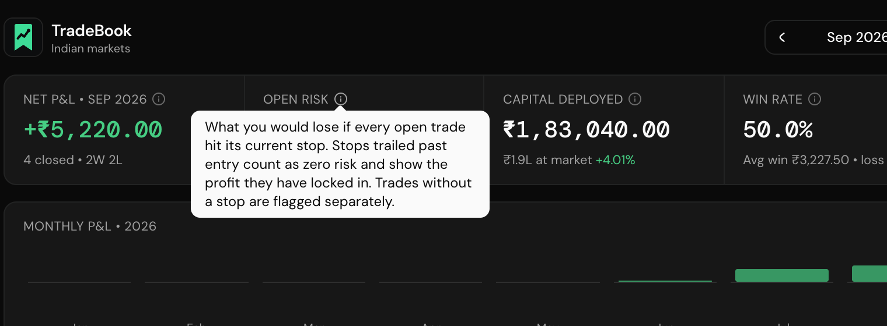

# TradeBook

A private trading journal for Indian markets. Log swing, positional and F&O trades, trail your stops, and see month-by-month performance. Everything stays in your browser: no account, no server database, nothing uploaded.



## Features

- **Single-screen dashboard**: key metrics, a monthly P&L chart, and open and closed trades, all on one page.
- **Month-by-month tracking**: step through months or switch to all time. A trade counts in the month it was **closed**.
- **NSE and BSE symbol search**: search about 42k stocks, futures and options (e.g. `nifty 25000 ce`). Picking one fills in the instrument type, lot size and last close.
- **End-of-day prices**: downloaded from the official NSE and BSE bhav copies once per trading day after 5 PM IST, and used for the last price and unrealized P&L.
- **Trailing stops**: every trade keeps its initial stop (which defines 1R) plus a dated history of stop moves. A trail dialog has a breakeven shortcut, shows the distance from the market price, and warns if you widen your stop.
- **Strategy labels**: tag trades (Breakout, Pullback, Earnings…) and filter the whole dashboard by one or more labels.
- **Sortable trade table**: two-line rows with logos, side, instrument and exchange, stop and target with reward-to-risk, % move and R-multiples. Click any row to edit it.
- **Open in TradingView**: one click opens the chart for the stock, or for the underlying index or stock of an F&O contract.
- **Metric tooltips**: every metric explains itself on hover.
- **Backups**: export and import your journal as JSON.
- **Dark and light themes**: dark by default.

## Metrics

| Metric | What it means |
|---|---|
| **Net P&L** | Realized profit after fees from trades closed in the selected month. |
| **Open risk** | What you would lose if every open trade hit its current stop. Also shows profit locked in by trailed stops. |
| **Capital deployed** | Money tied up in open long stock and option positions at entry price, plus their value and % move at the last close. |
| **Win rate** | Share of closed trades that made money, with the average win and average loss. |
| **Expectancy** | Average profit per closed trade, in rupees and in R. |
| **Profit factor** | Total profit from winners divided by total loss from losers. Above 1 means you are profitable. |

On each trade row:

| Figure | What it means |
|---|---|
| **R-multiple** | Profit or loss divided by the initial risk (entry to **initial** stop). Trailing a stop never changes it. |
| **Reward : risk** | Distance to target divided by distance to initial stop, e.g. `T 1,300 • 4.00R`. |
| **Unrealized** | Open P&L at the last close, with % move and R. |
| **Open risk** | Loss if this trade hits its current stop. Zero once the stop is at or past entry, when the stop is marked **Risk-free**. |
| **Qty** | Units held, with the position value (e.g. `₹47.2K`, or `2 lots • ₹390` for F&O). |

## Screenshots

| | |
|---|---|
|  |  |
| **Closed trades** with % move and R-multiples | **Symbol search** across NSE and BSE stocks, futures and options |
|  |  |
| **Trail stop** with market price, locked-in profit and distance from market | **Light theme** |



## Getting started

Requirements: Node.js 20.9 or newer and npm.

```bash
git clone https://github.com/Rushi0508/tradebook.git
cd tradebook
npm install
cp .env.example .env.local   # then add your Logo.dev publishable key
npm run dev
```

Open [http://localhost:3000](http://localhost:3000).

### Environment variables

| Variable | Required | Purpose |
|---|---|---|
| `NEXT_PUBLIC_LOGO_DEV_KEY` | No | [Logo.dev](https://logo.dev) **publishable** key (`pk_…`) for company logos. Without it, trades show initials instead. |

Only the publishable key is needed; it is designed to be used in the browser. Never put a Logo.dev secret key (`sk_…`) in this variable.

### Scripts

| Command | What it does |
|---|---|
| `npm run dev` | Start the development server |
| `npm run build` | Create a production build |
| `npm start` | Run the production build |
| `npm run lint` | Run ESLint |

## How your data is stored

- Trades and labels are saved in your browser's **IndexedDB** via [Dexie](https://dexie.org). They survive reloads and restarts.
- The app asks the browser for **persistent storage**, so your data isn't cleared automatically when the disk runs low. Settings shows whether it was granted.
- Clearing site data in your browser **deletes your journal**. Use **Settings → Export JSON** regularly, and **Import backup** to restore.
- Market data (about 19 MB) is cached in IndexedDB and replaced each trading day. Backups do not include it; it re-downloads automatically.
- On Safari, data can be removed after 7 days without a visit unless the app is added to the Home Screen or Dock.

## Market data

- The `/api/market` route downloads the latest NSE and BSE bhav copies (stocks and F&O), merges them, and returns instruments with close prices and lot sizes. Stocks listed on both exchanges appear once, under NSE.
- The browser refreshes the list once per trading day after **5 PM IST**, retrying hourly until the new file is published. Click the price status in the header to refresh by hand.
- Prices are **end of day**, not live.
- The bhav copies come from the exchanges' public archives, not an official API. If NSE or BSE change their file names or block downloads, price updates will stop until the app is updated. Your journal keeps working either way.

## Known limitations

- **One exit per trade**: partial exits are not supported yet.
- **Capital deployed** excludes futures and short positions, because they use margin rather than full cost.
- **TradingView links** for options and futures open the underlying's chart, not the individual contract.
- **Percentages are per trade or position**, not account-level returns. There is no account capital tracking.

## Tech stack

- [Next.js 16](https://nextjs.org) (App Router) with React 19 and TypeScript
- [shadcn/ui](https://ui.shadcn.com) on [Base UI](https://base-ui.com), styled with Tailwind CSS v4
- [TanStack Table v9](https://tanstack.com/table) for the trades table
- [Dexie](https://dexie.org) for IndexedDB storage
- [date-fns](https://date-fns.org), [Hugeicons](https://hugeicons.com), [fflate](https://github.com/101arrowz/fflate) (unzipping bhav copies)
- DM Sans and DM Mono fonts

## Project structure

```
src/
├── app/
│   ├── api/market/route.ts      # NSE + BSE bhav copy endpoint
│   ├── layout.tsx               # fonts, theme and providers
│   └── page.tsx
├── components/
│   ├── tradebook/               # dashboard, trade form, tables, dialogs
│   └── ui/                      # shadcn/ui components
├── hooks/                       # useTradebook, useMarketSync, useQuotes
└── lib/
    ├── db.ts                    # Dexie schema, migrations, backups
    ├── metrics.ts               # P&L, risk, R-multiples and stats
    ├── tooltips.ts              # copy for every metric tooltip
    ├── format.ts                # INR and number formatting
    └── market/                  # bhav copy parsing, sync, TradingView symbols
```
